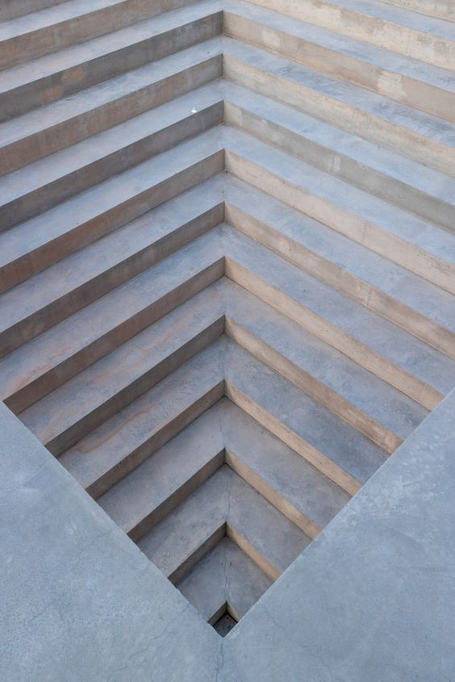
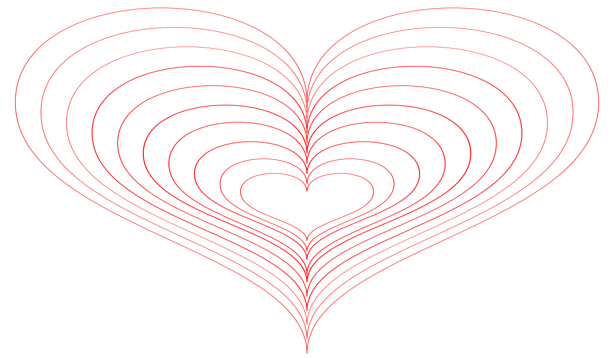
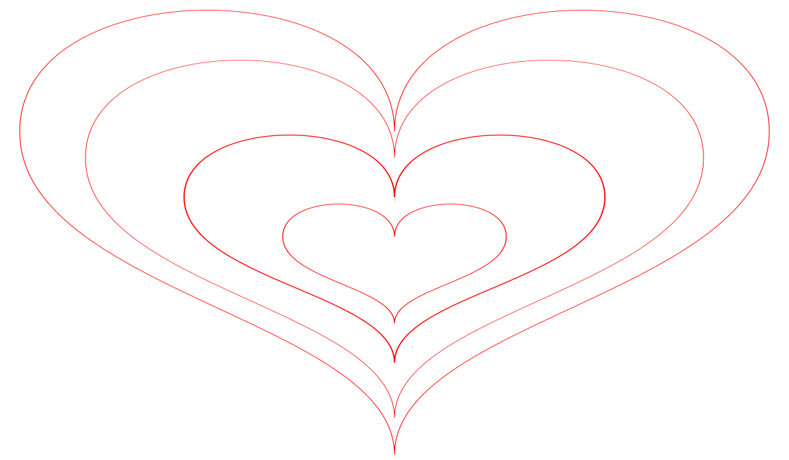
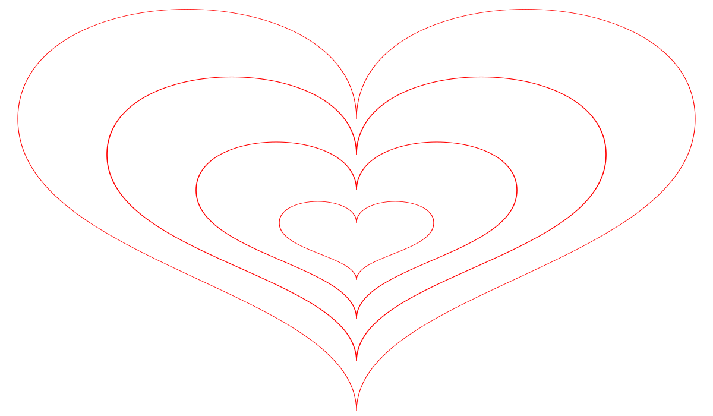
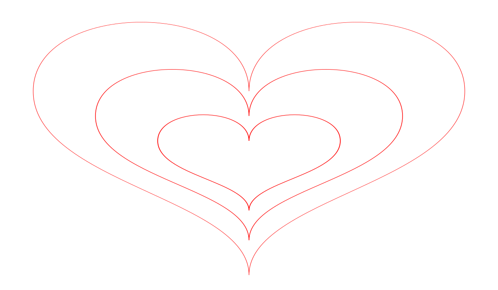

# SVG files for Laser cutting

Cut up **three** layers of thin material that serve as **top** of the stairs.
They overlap each other by **two thirds** of their width.

Cut up **one** layer of thick material, minimum 12 mm, to serve as the walls of
the stairs. LED strips will be stuck against them facing the inside.

## Arrangement

Like a staircase going down or an inverted pyramid in love-heart shape:

Source: https://minimalissimo.com/articles/mcneal-020

Sketch of build plan:

## Files

| Filename          | Legend        | Content                           |
| ----------------- | ------------- | --------------------------------- |
| heart-thick.svg   | cross-hatched |    |
| heart-thin-01.svg | blue          |  |
| heart-thin-02.svg | red           |  |
| heart-thin-03.svg | green         |  |
